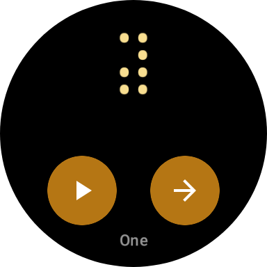

# Pttrn

A mindful pattern recognition app designed to provide a calming and engaging experience for neurodivergent individuals and anyone seeking a moment of focus and tranquility. The app vibrates random or predefined patterns which you can focus on with the goal of recognizing the pattern or parts of the pattern.

The goal was to create a simple and intuitive experience for the user but if you feel some features are missing or could be better, please let me know!

## About

Pttrn is a unique Android application that combines the power of pattern recognition with therapeutic benefits. Primarily designed for individuals on the autism spectrum, this app offers an interactive space to engage with vibration patterns in a way that can help:

- Provide a calming activity during stressful situations
- Create an engaging focus point when feeling overwhelmed
- Offer a fun and relaxing way to exercise pattern recognition skills
- Serve as a mindfulness tool for anxiety management

## Usage

Open the app and select a pattern to start with. The random patterns are truly randomized and therefore more challenging than the other predefined patterns.  Swipe up and down to increase or decrease the intensity of the vibrations.

## Development Note

This application was developed with significant assistance from AI technology, which has contributed to both its innovative features and some of its unique implementation approaches. While this AI-assisted development has allowed us to create something special, you might notice some quirks in the code structure - these are part of what makes Pttrn unique!

## Features

- Interactive pattern recognition exercises
- Calming visual interfaces
- Simple, intuitive user interface designed for accessibility

## Target Audience

- Individuals on the autism spectrum looking for a calming activity
- People with anxiety who need a focusing tool
- Anyone who enjoys pattern recognition as a form of relaxation
- Those seeking a mindful activity for stress relief

## Contributing

We welcome contributions to make Pttrn even better! Whether you're fixing bugs, improving documentation, or adding new features, please feel free to submit a pull request.

